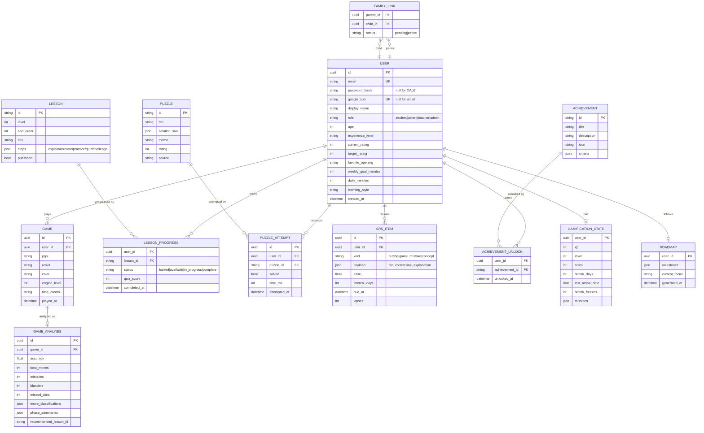

# ChessMaster Academy — System Architecture

## 1. High-level architecture

```
┌────────────────────────────── Browser ──────────────────────────────┐
│  Next.js (React 18, TypeScript, Tailwind)                           │
│  ├─ App Router pages (home, learn, tactics, play, analyze, coach…)  │
│  ├─ chess.js        — rules, legality, PGN/FEN                      │
│  ├─ react-chessboard — interactive board UI                         │
│  ├─ Stockfish WASM  — Web Worker: play levels, hints, analysis      │
│  ├─ Zustand store   — profile, progress, SRS, gamification          │
│  └─ Sync layer      — localStorage (guest) ⇄ REST API (signed in)   │
└───────────────┬─────────────────────────────────────────────────────┘
                │ HTTPS / JSON (OpenAPI)
┌───────────────▼─────────────────────────────────────────────────────┐
│  FastAPI (Python 3.12)                                              │
│  ├─ /auth      — email+password, Google OAuth, JWT access/refresh   │
│  ├─ /users     — profile, roadmap, settings, roles                  │
│  ├─ /progress  — lessons, puzzles, SRS items, gamification state    │
│  ├─ /games     — store games + analysis summaries                   │
│  ├─ /family    — parent↔child links, weekly reports                 │
│  ├─ /leaderboard, /content (admin CRUD)                             │
│  └─ SQLAlchemy 2.0 + Alembic                                        │
└──────┬──────────────────────────────┬───────────────────────────────┘
       │                              │
┌──────▼───────┐              ┌───────▼──────┐
│ PostgreSQL   │              │ Redis        │
│ (SQLite dev) │              │ cache/queues │
└──────────────┘              └──────────────┘
```

**Key decision — client-side engine.** Stockfish runs as WASM in a Web Worker in the
browser. Play, hints, and post-game analysis need zero server compute, work offline,
and scale for free. The server stores *results* (games, analysis summaries, progress),
not engine sessions.

**Key decision — guest-first sync.** All progress lives in a versioned client store
persisted to localStorage. On sign-in it merges to the server (last-write-wins per
key, additive for XP/history). The app is fully usable before creating an account —
critical for children and school labs.

## 2. Database ER diagram



## 3. API design (REST, `/api/v1`)

| Method & path | Purpose | Auth |
|---|---|---|
| `POST /auth/register` | Email signup → tokens | — |
| `POST /auth/login` | Email login → tokens | — |
| `POST /auth/google` | Exchange Google ID token → tokens | — |
| `POST /auth/refresh` | Rotate refresh token | refresh |
| `GET /users/me` · `PATCH /users/me` | Profile + onboarding fields | access |
| `GET/PUT /users/me/roadmap` | Personalized roadmap | access |
| `GET/PUT /progress/sync` | Bulk client-state sync (versioned blob + server merge) | access |
| `GET /progress/lessons` · `PUT /progress/lessons/{id}` | Lesson progress | access |
| `POST /progress/puzzle-attempts` | Record attempt (updates puzzle rating) | access |
| `GET /srs/due` · `POST /srs/review` | Spaced-repetition queue | access |
| `POST /games` · `GET /games` · `GET /games/{id}` | Store/list games + analysis | access |
| `GET /gamification` · `POST /gamification/events` | XP/coins/streak events | access |
| `GET /leaderboard?scope=weekly_xp` | Leaderboards | access |
| `POST /family/invite` · `POST /family/accept` | Parent↔child link | access |
| `GET /family/children/{id}/report?week=` | Parent weekly report (JSON, printable client-side) | parent |
| `GET/POST/PUT/DELETE /content/{lessons,puzzles,openings,achievements}` | Admin CMS | admin |
| `GET /healthz` | Liveness | — |

Errors: RFC 7807 problem+json. All endpoints documented via auto-generated Swagger at `/docs`.

## 4. Frontend folder structure

```
frontend/
├─ src/
│  ├─ app/                    # Next.js App Router
│  │  ├─ page.tsx             # Home (hero, daily progress, continue learning…)
│  │  ├─ onboarding/
│  │  ├─ dashboard/
│  │  ├─ learn/               # path overview + /learn/[lessonId]
│  │  ├─ tactics/
│  │  ├─ checkmates/
│  │  ├─ openings/            # + /openings/[openingId]
│  │  ├─ endgames/
│  │  ├─ play/
│  │  ├─ analysis/[gameId]/
│  │  ├─ coach/               # AI coach chat + session generator
│  │  ├─ review/              # SRS due queue
│  │  ├─ progress/            # analytics
│  │  ├─ parents/
│  │  └─ admin/
│  ├─ components/
│  │  ├─ board/               # ChessBoard wrapper, arrows, highlights
│  │  ├─ lesson/              # LessonPlayer, Quiz, GuidedPractice
│  │  └─ ui/                  # Cards, ProgressRing, StatTile, Badge…
│  ├─ engine/                 # stockfish worker client, evaluation, classification
│  ├─ lib/                    # coach logic, srs, gamification, analysis, sync
│  ├─ data/                   # lessons, puzzles (verified), openings, endgames, achievements
│  └─ store/                  # Zustand persisted store
└─ public/engine/             # stockfish wasm assets
```

## 5. Backend folder structure

```
backend/
├─ app/
│  ├─ main.py                 # FastAPI app, CORS, routers, /docs
│  ├─ core/                   # config, security (JWT, hashing), deps
│  ├─ models/                 # SQLAlchemy models (§2)
│  ├─ schemas/                # Pydantic v2 schemas
│  ├─ api/                    # routers: auth, users, progress, games, srs,
│  │                          #  gamification, leaderboard, family, content
│  └─ services/               # merge/sync, reports, ratings
├─ tests/
├─ alembic/
└─ Dockerfile
```

## 6. Security & privacy

- Argon2 password hashing; JWT HS256 dev / RS256 prod; refresh rotation with reuse detection.
- RBAC middleware: student/parent/teacher/admin.
- Children: no free-text public fields, display names moderated, no DMs; parent consent
  captured at family-link time.
- Rate limiting via Redis (login, sync).

## 7. Deployment

- `docker-compose.yml`: `web` (Next standalone), `api` (uvicorn), `db` (postgres:16), `redis`.
- CI: lint → typecheck → unit tests → integration tests → build images.
- Prod: web on Vercel or containerized behind nginx; API on any container host; managed Postgres.
```
